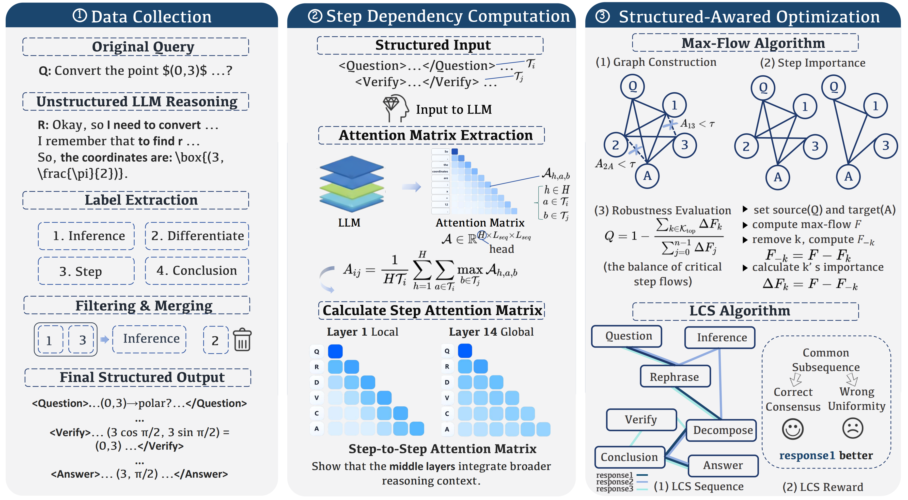
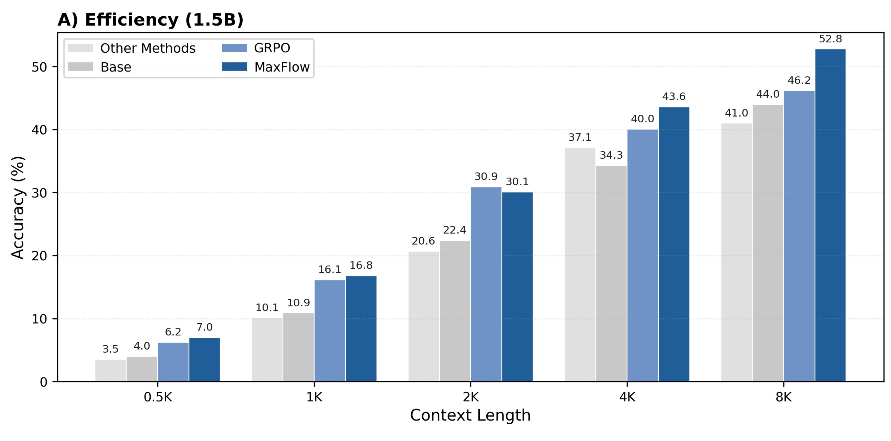
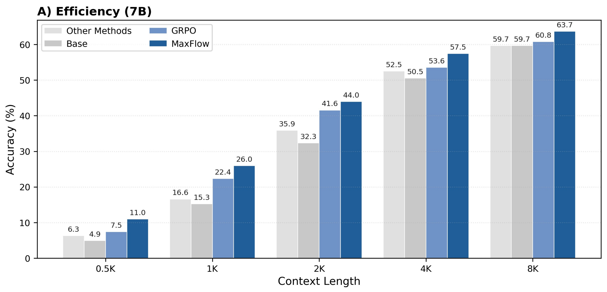
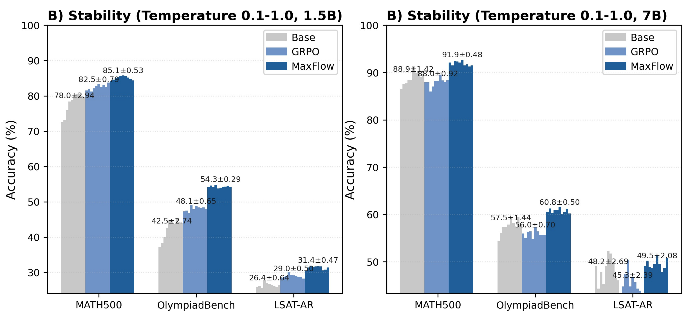
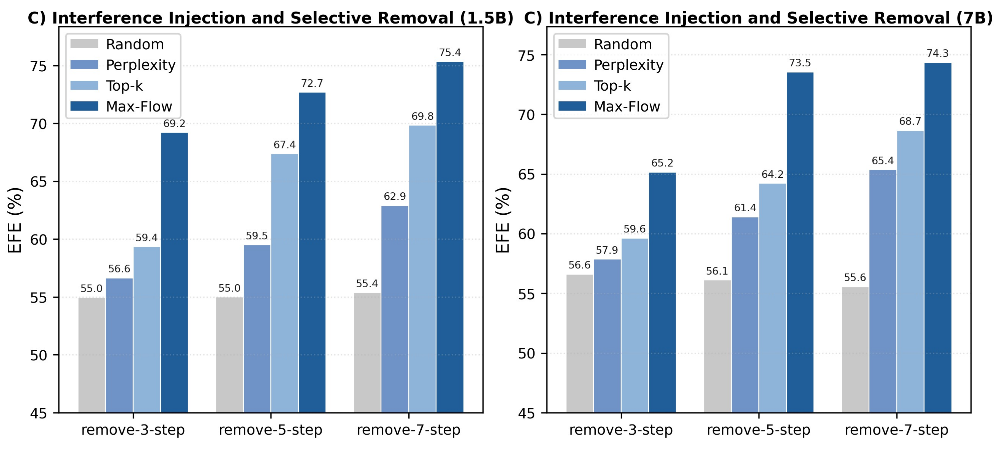

# (ICLR 2026) Structured Reasoning

<p align="center">
  <a href="https://proceedings.iclr.cc/paper_files/paper/2026/hash/ad5b3f324b24c17cdc2f3712298c76bd-Abstract-Conference.html"></a>
  <a href="https://arxiv.org/abs/2506.20241"></a>
  <a href="https://huggingface.co/datasets/FreeFrank/Structured-Reasoning"></a>
  <a href="https://cnsdqd-dyb.github.io/Enhancing-Large-Language-Models-through-Structured-Reasoning/analyzer.html#SRA"></a>
</p>

**Structured Reasoning for LLMs: A Unified Framework for Efficiency and Explainability**  
Yubo Dong, Hehe Fan, Linchao Zhu, and Yi Yang · ICLR 2026

[Paper](https://proceedings.iclr.cc/paper_files/paper/2026/hash/ad5b3f324b24c17cdc2f3712298c76bd-Abstract-Conference.html) · [Project page](https://cnsdqd-dyb.github.io/Enhancing-Large-Language-Models-through-Structured-Reasoning/) · [Dataset on Hugging Face](https://huggingface.co/datasets/FreeFrank/Structured-Reasoning)

This is the project repository linked from the [original arXiv paper](https://arxiv.org/abs/2506.20241). The ICLR 2026 paper links to the original project URL. Website source is now maintained here in [`docs/`](docs/); the old website repository is retained only to redirect existing paper links.

The framework organizes reasoning into cognitive steps to study reasoning efficiency and explainability. The dataset is publicly available below; training code and model checkpoints have not yet been released in this repository.

## Framework at a glance

<p align="center">
  <a href="docs/static/images/method/pipeline.png"></a>
</p>

**Annotate → connect → optimize.** Organize reasoning into cognitive steps, analyze step dependencies using model attention, and guide optimization with MaxFlow and LCS rewards. Click any figure to view it at full resolution.

## Results from the paper

<table>
  <tr>
    <td width="50%" align="center"><br><sub>Efficiency · 1.5B model</sub></td>
    <td width="50%" align="center"><br><sub>Efficiency · 7B model</sub></td>
  </tr>
</table>

<p align="center">
  
  <br><sub>Stability across decoding temperatures · 1.5B and 7B models</sub>
</p>

<p align="center">
  
  <br><sub>Interference injection and selective removal · 1.5B and 7B models</sub>
</p>

These figures present the paper's experiments. See the [paper](https://proceedings.iclr.cc/paper_files/paper/2026/hash/ad5b3f324b24c17cdc2f3712298c76bd-Abstract-Conference.html) for benchmarks, metrics, and evaluation settings; the current dataset release is described separately below.

## Explore reasoning interactively

[**Open the step-dependency analyzer →**](https://cnsdqd-dyb.github.io/Enhancing-Large-Language-Models-through-Structured-Reasoning/analyzer.html#SRA)

Explore example reasoning traces and their step-dependency visualizations in the browser. The demo includes MATH500, OlympiadBench, LSAT, and DROP examples.

## Resources and release status

- [Project homepage](https://cnsdqd-dyb.github.io/Enhancing-Large-Language-Models-through-Structured-Reasoning/): paper, dataset, method overview, and release status.
- [Interactive research demo](https://cnsdqd-dyb.github.io/Enhancing-Large-Language-Models-through-Structured-Reasoning/analyzer.html#SRA): existing step-dependency visualization.
- [Open-source roadmap](ROADMAP.md): planned data tools, structured SFT, MaxFlow/LCS implementations, evaluation configurations, and checkpoints. Release dates are to be announced.

The paper, dataset, and demo are available. Training code and checkpoints are planned and have not yet been published in this repository.

## Dataset

[**FreeFrank/Structured-Reasoning**](https://huggingface.co/datasets/FreeFrank/Structured-Reasoning) is publicly available under the **MIT** license. It contains **516 examples** in one `train` split, with reasoning segmented using **23 cognitive step types**. Parquet and JSONL versions are provided.

```python
from datasets import load_dataset

dataset = load_dataset("FreeFrank/Structured-Reasoning", split="train")
example = dataset[0]
print(example["problem"])
print(example["reasoning"])
print(example["answer"])
```

| Field | Description |
|---|---|
| `problem_id` | Stable example identifier |
| `problem` | Problem statement |
| `reasoning` | Reasoning with paired cognitive step tags |
| `answer` | Answer target |
| `content` | Final response |
| `steps` | Ordered steps with `step_id`, `type`, and `text` |

For supervised training, use `problem` as the user prompt and construct the assistant target as follows:

```python
assistant_target = (
    "<think>\n" + example["reasoning"]
    + "\n</think>\n" + example["content"]
)
```

Ensure your chat template retains the reasoning and your context length accommodates the full target. With the checked DeepSeek-R1-Distill-Qwen-7B tokenizer, the longest serialized example has 26,698 tokens; a 32,768-token context accommodates all examples. Recheck lengths with your own tokenizer and template.

The release includes editorial curation and step annotations. It is not asserted to be the exact dataset used for the paper's reported experiments, and no independent corpus-wide correctness estimate is reported. Question provenance, source attribution, license terms, and further usage details are available in the [dataset card](https://huggingface.co/datasets/FreeFrank/Structured-Reasoning). Step annotations describe reasoning spans; they do not provide attention weights or dependency graph edges.

## Citation

```bibtex
@inproceedings{dong2026structuredreasoning,
  title = {Structured Reasoning for LLMs: A Unified Framework for Efficiency and Explainability},
  author = {Dong, Yubo and Fan, Hehe and Zhu, Linchao and Yang, Yi},
  booktitle = {International Conference on Learning Representations},
  year = {2026},
  url = {https://proceedings.iclr.cc/paper_files/paper/2026/hash/ad5b3f324b24c17cdc2f3712298c76bd-Abstract-Conference.html}
}
```

## Website source and publishing

The project homepage, analysis demo, figures, and example data live in `docs/` in this repository. Preview locally with `python -m http.server 8000 --directory docs`.

GitHub Pages publishes from `main` → `/docs`. The original paper URL, https://cnsdqd-dyb.github.io/structured-reasoning/, is retained through a redirect-only repository. All active website development belongs here.
